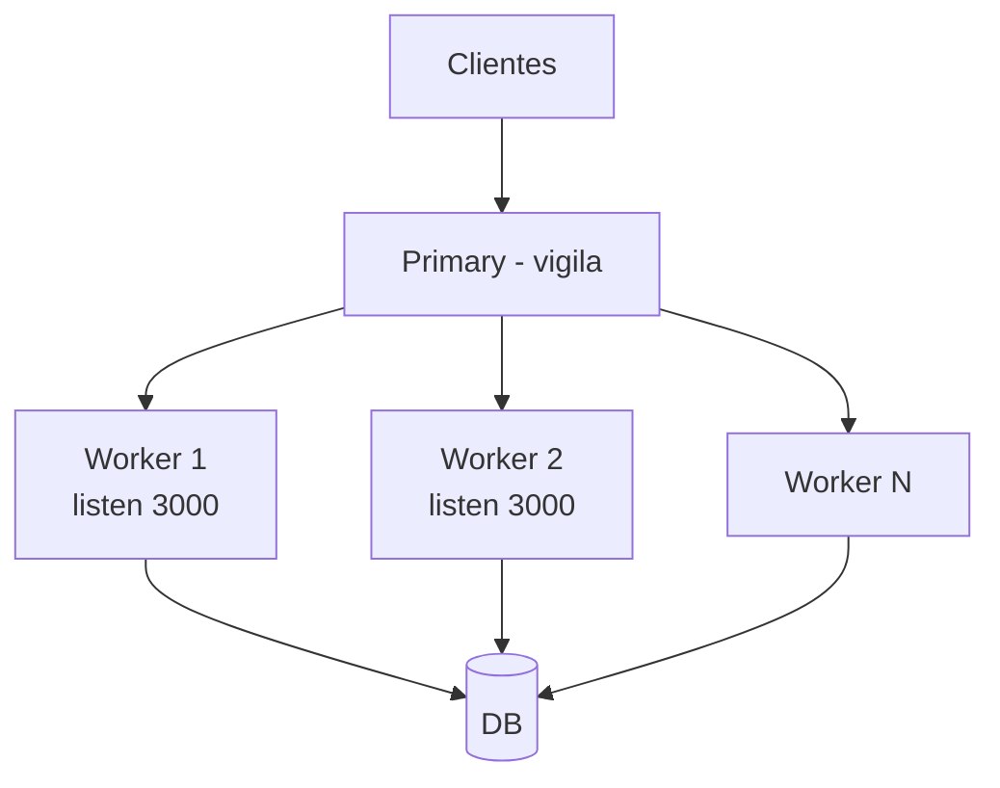

# 01 — Cluster: primer contacto guiado

**Qué lograrás:** al terminar tendrás un servidor clusterizado que usa todos tus cores, verás el refork en vivo y entenderás por qué Node lo necesita.

**Prerequisitos:** Node 22+, sabes `http.createServer` y `npm test`.

---

## 0. Comprueba dónde estás

```bash
git branch --show-current  # debe ser 01_modelo-cluster
npm test
# Esperas: 2 tests en rojo (✖ isPrimary, ✖ getExpectedForkCount) — es TDD, es normal.
```

> No ejecutes `node src/cluster-hello.js` todavía — no hará nada.

## 1. Abre y completa el esqueleto — aquí está el ejercicio

```bash
cat src/cluster-hello.js  # verás 4 TODOs numerados
```

**Tarea:** edita `src/cluster-hello.js` y completa los 4 TODOs.

**TODO 1 — Primary vs Worker:**
```js
// cambia `if (false)` por:
if (cluster.isPrimary && !isTestRun) {
} else if (!cluster.isPrimary) {
}
```
*Nota: `isPrimary` reemplazó a `isMaster` en Node 16 — el test te lo recuerda. Si quieres entender por qué, la sección [How it works](https://nodejs.org/api/cluster.html#how-it-works) de los docs lo explica.*

**TODO 2 — En primary, crea workers:**
Dentro del `if (cluster.isPrimary...)` escribe:
```js
const n = typeof os.availableParallelism === 'function' ? os.availableParallelism() : os.cpus().length;
console.log(`Primary ${process.pid} forking ${n} workers`);
for (let i = 0; i < n; i++) cluster.fork();
cluster.on('exit', (worker) => {
  console.log(`worker ${worker.process.pid} died, forking replacement`);
  cluster.fork();
});
```
*`availableParallelism()` es la forma recomendada desde Node 19 — respeta limits de Docker/K8s, a diferencia de `cpus().length` que siempre ve todos los cores físicos.*

**TODO 3 — En worker, crea servidor:**
Dentro del `else if (!cluster.isPrimary)` escribe:
```js
const server = http.createServer((req, res) => {
  res.writeHead(200, { 'Content-Type': 'text/plain' });
  res.end(`hello from ${process.pid}\n`);
});
if (!isTestRun) server.listen(PORT, () => console.log(`Worker ${process.pid} listening on ${PORT}`));
```
*¿Por qué todos hacen `listen` sin `EADDRINUSE`? En `SCHED_RR` (el default en Linux), el primary acepta conexiones y distribuye el handle a los workers. La sección [Scheduling Policy](https://nodejs.org/api/cluster.html#clusterschedulingpolicy) lo detalla.*

**TODO 4 — `getExpectedForkCount`:**
```js
export function getExpectedForkCount() {
  return typeof os.availableParallelism === 'function' ? os.availableParallelism() : os.cpus().length;
}
```

> Si te atascas, `npm test` te dice qué falta. Mira `git diff 01..02 -- src/cluster-hello.js` para la solución.

## 2. Verifica que aprendiste — sin consultar Reference

```bash
npm test
# Esperas: 5/5 verde (✔)
```

**Solo cuando esté verde**, pasa al siguiente paso.

## 3. Ejecuta y observa

```bash
node src/cluster-hello.js
# Esperas: "Primary <pid> forking 8 workers" + 8× "Worker <pid> listening on 3000"
# En otra terminal:
curl localhost:3000  # repite 4× → verás 4 PIDs distintos (round-robin)
ps aux | grep node   # 1 primary + N workers
kill <un_worker_pid>
# Esperas: "worker <pid> died, forking replacement" + nuevo PID distinto
```

**Qué observar:**
- Mismo puerto sin `EADDRINUSE` — Node comparte el handle.
- `curl` con PIDs distintos — el balanceo funciona.
- Sin `cluster.on('exit')`, un `kill` deja un core menos.

*¿Quieres ver qué hace `fork()` internamente? Es `child_process.fork()` disfrazado — los docs de [cluster.fork()](https://nodejs.org/api/cluster.html#clusterforkenv) lo explican. ¿Por qué no auto-gestiona el pool de workers? Los docs dicen: "Node.js does not automatically manage the number of workers — it is the application's responsibility".*

## 4. Siguiente paso

Cuando `npm test` esté verde **y** hayas visto el refork con `kill`:
```bash
git switch 02_cluster-produccion  # hereda tu solución, empieza el siguiente TODO (graceful)
```

> **Modelo mental:** Node usa 1 hilo → 1 core. `cluster.fork()` crea procesos con su V8. El Primary no atiende, solo vigila. Todos hacen `listen(PORT)` y Node reparte.



## 5. Push y PR

```bash
git switch -c 01_mi-solucion       # crea tu branch
# ... escribe código hasta verde ...
git add -A && git commit -m "feat: 01 completado"
git push -u origin 01_mi-solucion   # sube
# Abre PR en GitHub: 01_mi-solucion → 01_modelo-cluster
# CI verifica automáticamente → ✅ mergea, ❌ arregla
```

## 5. Push y PR

```bash
git switch -c 01_mi-solucion       # crea tu branch
# ... escribe código hasta verde ...
git add -A && git commit -m "feat: 01 completado"
git push -u origin 01_mi-solucion   # sube
gh pr create --base 01_modelo-cluster --title "01 completado" --body "npm test pasa 5/5"
# CI verifica → ✅ mergea, ❌ arregla
```
