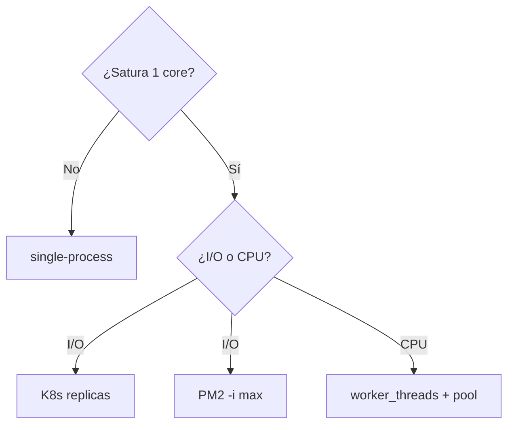

# 02 — Cluster a producción (graceful + PM2)

Para quien ya hizo `01` (sabe `isPrimary`/`fork`). **Vas a escribir el graceful, no solo leerlo.**

**Qué lograrás:** un cluster que no corta requests a mitad y sabrás elegir `PM2` vs `K8s`.

**Prerequisitos:** `01` hecho, sabes `http.createServer`.

---

## 0. Comprueba dónde estás

```bash
git branch --show-current  # 02_cluster-produccion
npm test
# Esperas: 3 tests en rojo (✖ graceful, ✖ health, ✖ integración) + 1 verde (state)
```

> No ejecutes `node src/cluster-graceful.js` todavía — aún no tiene graceful.

## 1. Abre y completa el esqueleto

```bash
cat src/cluster-graceful.js  # verás 2 TODOs
cat src/cluster-state.js     # demo del problema de estado (no lo edites)
```

**TODO 1 — Graceful shutdown:**
Abre `src/cluster-graceful.js` y dentro de `createServer` añade, justo antes del `return server;`:
```js
process.on('SIGTERM', () => server.close(() => process.exit(0)));
process.on('SIGINT',  () => server.close(() => process.exit(0)));
```

**TODO 2 — Healthcheck `/health`:**
Dentro del `http.createServer((req, res) => {` añade al inicio:
```js
if (req.url === '/health') {
  res.writeHead(200, { 'Content-Type': 'application/json' });
  res.end(JSON.stringify({ status: 'ok', pid: process.pid }));
  return;
}
```

> Si te atascas, `npm test` te dice qué falta. Mira `git diff 02..03 -- src/cluster-graceful.js` para la solución.

## 2. Verifica

```bash
npm test
# Esperas: 4/4 verde (✔ graceful, ✔ health, ✔ state, ✔ integración)
```

**Solo cuando esté verde**, sigue.

## 3. Ejecuta y observa

```bash
node src/cluster-graceful.js &
curl localhost:3001/health  # → {"status":"ok","pid":12345}
kill -SIGTERM <pid>
# Esperas: cierra limpio, sin ECONNRESET.
```

**Qué observar:**
- Sin `server.close`, `curl` en curso recibe `ECONNRESET`.
- `visits` en `src/cluster-state.js` no suma global (cada worker su heap) → externaliza a Redis.

## 4. PM2 vs K8s

| Si deployas en... | Haz... |
|---|---|
| VM sin orquestador | `pm2 start src/cluster-graceful.js -i max --name app && pm2 reload app` |
| K8s / ECS | 1 proceso por pod + HPA, sin cluster dentro |
| Entrevista/demo | `cluster` nativo |

## 5. Siguiente paso

```bash
git switch 03_modelo-worker-threads  # hereda tu solución, empieza Worker
```



## Push y PR

```bash
git switch -c 02_mi-solucion
# ... escribe hasta verde ...
git add -A \&\& git commit -m "feat: 02 completado"
git push -u origin 02_mi-solucion
gh pr create --base 02_cluster-produccion --title "02 completado" --body "npm test pasa"
# CI verifica → ✅ mergea, ❌ arregla
```
