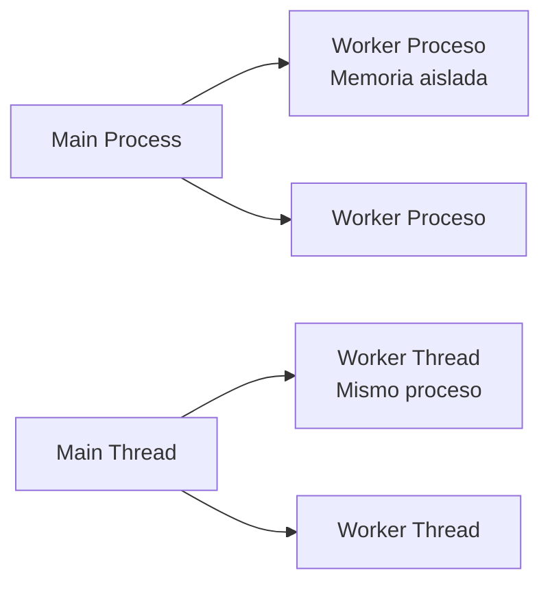

# 03 — Worker Threads: primer hilo sin bloquear el loop

Asume que hiciste `01` (sabes qué es un proceso). **Vas a escribir tu primer Worker, no solo leerlo.**

**Qué lograrás:** crear un `Worker` que devuelve `42` y mover un hash CPU-intensivo fuera del event loop. Verificación: `npm test` 4/4 + `tick` sigue vivo durante el hash.

---

## 0. Comprueba dónde estás

```bash
git branch --show-current  # 03_modelo-worker-threads
npm test
# Esperas: 4 tests en rojo (✖ isMainThread, ✖ Worker duplica, ✖ hashInWorker, ✖ workerData) — es TDD, es normal.
# Si ves 4 verde, ya está resuelto (mira git diff 03..04).
```

> No ejecutes `node src/worker-hello.js` todavía — aún no hay Worker.

## 1. Abre y completa el esqueleto

```bash
cat src/worker-hello.js  # verás 3 TODOs
cat src/worker-cpu.js    # verás 1 TODO
```

**TODO 1 — `src/worker-hello.js` → `runWorker`:**
Abre `src/worker-hello.js` y completa `runWorker(payload)`:
```js
export function runWorker(payload) {
  return new Promise((resolve, reject) => {
    const w = new Worker(new URL(import.meta.url), { workerData: payload });
    w.on('message', resolve);
    w.on('error', reject);
    w.on('exit', (code) => { if (code !== 0) reject(new Error(`exit ${code}`)); });
  });
}
```

**TODO 2 — `src/worker-hello.js` → worker thread:**
Al final del archivo, fuera de `isMainThread`, añade:
```js
if (!isMainThread) {
  const result = workerData * 2;
  parentPort.postMessage(result);
}
```
*Necesitas arriba:* `import { Worker, isMainThread, parentPort, workerData } from 'node:worker_threads';` (ya está a medias, completa el import).

**TODO 3 — `src/worker-cpu.js` → `hashInWorker`:**
Abre `src/worker-cpu.js` y completa `hashInWorker(input, iterations)` igual que `runWorker`, pero dentro del worker haz `hashSync`:
```js
export function hashInWorker(input, iterations = 100000) {
  return new Promise((resolve, reject) => {
    const w = new Worker(new URL(import.meta.url), { workerData: { input, iterations } });
    w.on('message', resolve);
    w.on('error', reject);
  });
}
if (!isMainThread) {
  const { input, iterations } = workerData;
  const result = hashSync(input, iterations);
  parentPort.postMessage(result);
}
```

> Si te atascas, `npm test` te dice qué falta (`isMainThread`, `parentPort`, `workerData`). No mires `04` todavía.

## 2. Verifica

```bash
npm test
# Esperas: 4/4 verde (✔ isMainThread, ✔ Worker duplica 21→42, ✔ hashInWorker, ✔ workerData)
```

**Solo cuando esté verde**, sigue.

## 3. Ejecuta y observa

```bash
node -e "import('./src/worker-hello.js').then(m=>m.runWorker(21).then(r=>console.log('21*2 =',r)))"
# Esperas: 21*2 = 42

# Compara bloqueo:
node -e "
import { hashSync } from './src/worker-cpu.js';
import { hashInWorker } from './src/worker-cpu.js';
setInterval(()=>process.stdout.write('tick '),100);
console.time('sync'); hashSync('x', 50000); console.timeEnd('sync');
console.time('worker'); await hashInWorker('x', 50000); console.timeEnd('worker');
"
# Observa: `sync` pausa los ticks, `worker` no — el loop sigue vivo.
```

**Qué observar:**
- Worker no duplica V8 como `cluster` (menos memoria).
- Sin `w.on('error')`, un `throw` en el worker se silencia.

## 4. Siguiente paso

```bash
git diff  # mira tu Worker
git switch 04_worker-threads-practica  # hereda tu Worker, empieza pool
```
Si quieres ver la solución completa: `git diff 03_modelo-worker-threads..04_worker-threads-practica -- src/worker-hello.js`.

> **Modelo mínimo:** `cluster` = procesos (memoria aislada, I/O), `worker_threads` = hilos (memoria compartible con `SharedArrayBuffer`, CPU). Detalle profundo → `cluster-vs-worker.md`.



## Push y PR

```bash
git switch -c 03_mi-solucion
# ... escribe hasta verde ...
git add -A \&\& git commit -m "feat: 03 completado"
git push -u origin 03_mi-solucion
gh pr create --base 03_modelo-worker-threads --title "03 completado" --body "npm test pasa"
# CI verifica → ✅ mergea, ❌ arregla
```
