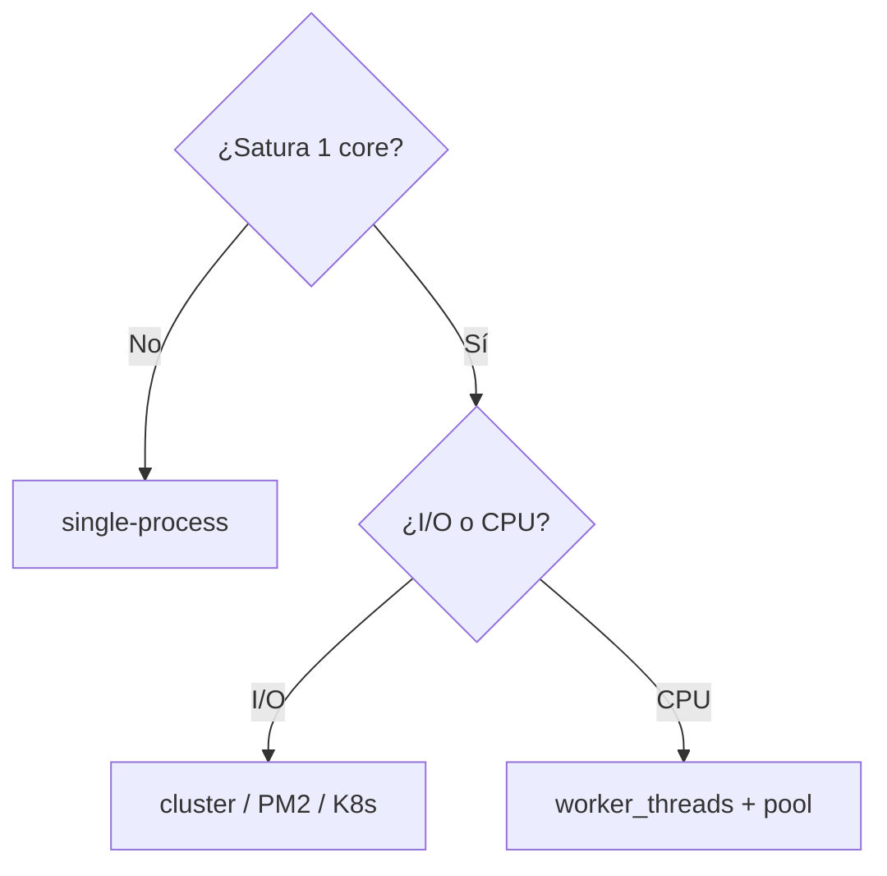

# 05 — Cuándo usar (y cuándo no) cluster y worker_threads


**Qué lograrás:** decidir en 30s si usar `cluster`, `worker_threads`, `single` o `pool` sin dudar, y explicar el trade-off. Verificación: `npm test` 5/5 + árboles de memoria.

---

## 0. Comprueba dónde estás

```bash
git branch --show-current  # 05_decision-troubleshooting
npm test
# Esperas: 4 tests en rojo (✖ decide, ✖ tradeoff) + 1 verde (docs/errores) — es TDD, es normal.
# Si ves 5 verde, ya está resuelto (mira git diff 05..06).
```

> No leas todos los árboles todavía — primero haz el código.

## 1. Abre y completa el esqueleto

```bash
cat src/decision.js  # verás 2 TODOs (decide + explainTradeoff)
```

**TODO 1 — `decide(opts)`:**
Abre `src/decision.js` y completa `decide({ cpuBound, ioBound, needSharedMemory, needMultipleIdenticalServers, cpus })`:
```js
export function decide({ cpuBound, ioBound, needSharedMemory, needMultipleIdenticalServers, cpus = 4 } = {}) {
  if (needMultipleIdenticalServers && ioBound) {
    if (cpus <= 1) return 'single-process';
    return 'cluster'; // o pm2/k8s en prod — ver 02
  }
  if (cpuBound) {
    if (needSharedMemory) return 'worker_threads-shared';
    return 'worker_threads';
  }
  return 'single-process';
}
```

**TODO 2 — `explainTradeoff(choice)`:**
```js
export function explainTradeoff(choice) {
  const map = {
    cluster: '+ throughput I/O, − N× RAM, sin estado compartido',
    'worker_threads': '+ no bloquea loop, hilos ligeros, − complejidad, SharedArrayBuffer con cuidado',
    'single-process': '+ simple, − no escala multi-core',
  };
  return map[choice] || 'unknown';
}
```

> Si te atascas, `npm test` te dice qué falta (`cluster`, `worker_threads-shared`, `memoria`). No mires `06` todavía.

## 2. Verifica

```bash
npm test
# Esperas: 5/5 verde (✔ decide I/O, ✔ decide CPU, ✔ single, ✔ tradeoff, ✔ docs/errores)
```

**Solo cuando esté verde**, sigue.

## 3. Ejecuta y observa — los árboles

Ahora sí lee los árboles. No los memorices, úsalos para decidir:



**Prueba en voz alta (entrevista):**
```bash
node -e "
import { decide, explainTradeoff } from './src/decision.js';
console.log(decide({ioBound:true, needMultipleIdenticalServers:true, cpus:4})); // cluster
console.log(decide({cpuBound:true})); // worker_threads
console.log(explainTradeoff('cluster'));
"
```
*Di en voz alta:* “Depende si el cuello es I/O o CPU y dónde deployo; con el árbol elijo X, pero matizo sticky/memory”.

**Qué observar:**
- Sin `availableParallelism()` y sin `cpus`, el árbol miente en Docker.
- Crear workers > `availableParallelism()` sin pool → thrashing.

## 4. Qué no es este doc

- No lista APIs exhaustivas (`schedulingPolicy`) → `cheat-sheet.md`.
- No te guía para crear un cluster → `01` (Tutorial).

## 5. Siguiente paso

```bash
git diff  # mira tu decide
git switch 06_simulacro-entrevista  # hereda tu decisión, empieza simulacro
```
Si quieres ver la solución completa: `git diff 05_decision-troubleshooting..06_simulacro-entrevista -- src/decision.js`.

> **Trade-offs que importan para entrevista:** ver `cluster-vs-worker.md` y `errores.md` — ya los tienes, pero ahora con código que los respalda.

## Push y PR

```bash
git switch -c 05_mi-solucion
# ... escribe hasta verde ...
git add -A \&\& git commit -m "feat: 05 completado"
git push -u origin 05_mi-solucion
gh pr create --base 05_decision-troubleshooting --title "05 completado" --body "npm test pasa"
# CI verifica → ✅ mergea, ❌ arregla
```
