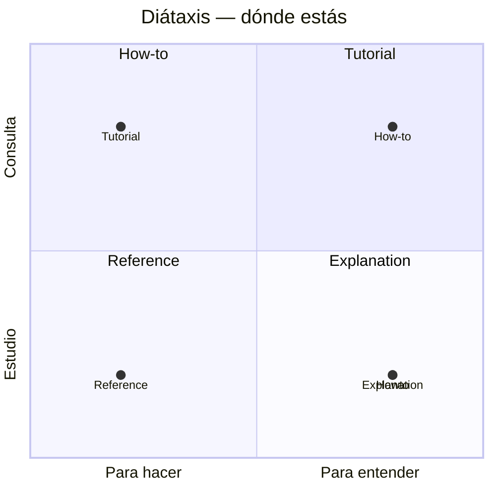

# Documentación — Sistema Diátaxis

> Esta guía no está organizada por capítulos, sino por **para qué vienes**. Diátaxis separa 4 necesidades distintas porque se contradicen: lo que sirve para aprender no sirve para consultar.

| Si vienes a... | Ve a... | Diátaxis | Qué esperar |
|---|---|---|---|
| **Aprender haciendo**, sin saber nada del tema, guiado paso a paso | `01-modelo-cluster.md`, `03-modelo-worker-threads.md`, `04-worker-threads-practica.md` | **Tutorial** · *learning-oriented* | Te llevamos de la mano. Un camino concreto, sin opciones, con éxito garantizado al final. No asume nada, no lista alternativas. |
| **Resolver una tarea concreta** que ya entiendes | `02-cluster-produccion.md` (escalar/graceful), `simulacro.md` (ensayar entrevista), `respuestas-30s.md` (responder en 30s) | **How-to** · *task-oriented* | Objetivo claro. Pasos flexibles, asume que sabes lo básico. Sin explicar por qué — solo cómo. |
| **Consultar un dato exacto** sin leer narrativa | `cheat-sheet.md`, `recursos.md`, `flashcards*.md` | **Reference** · *information-oriented* | Seco, exhaustivo, consistente. Tablas y listas. Sin sorpresas, sin historia. Versión precisa (Node 20+, `isPrimary`). |
| **Entender por qué y cuándo**, contexto y trade-offs | `cluster-vs-worker.md`, `errores.md`, `05-decision-troubleshooting.md`, `VERIFICACION.md` | **Explanation** · *understanding-oriented* | Discursivo. Por qué existe, cuándo NO usar, qué cambia respecto al pasado, opinión fundamentada. No da pasos. |

## Fundamentos aplicados (no solo carpetas)

1. **Un documento, un propósito.** No mezclamos referencia exhaustiva dentro de un tutorial ni pasos dentro de una explicación. Si un tutorial necesita un dato, enlaza a Reference; no lo duplica.
2. **Audiencia explícita.** Cada doc declara arriba `Diátaxis: X · Para quien ...` y `Cuándo usarlo / Cuándo NO`.
3. **Tono coherente al propósito.**
   - Tutorial: segunda persona, presente, "vamos a", sin ramificaciones, verificable (`npm test` verde).
   - How-to: título empieza por "Cómo…", imperativo, asume `01/03` hechos.
   - Reference: nominal, sin verbos de acción, orden alfabético o por API, sin "deberías".
   - Explanation: narrativo, contextual, compara, cita fuentes (ver `VERIFICACION.md`).
4. **Mermaid solo donde aclara modelo mental.** No decora referencia.

## Cómo usar estos docs según Diátaxis

- **Primera vez (estudias 6h):** sigue Tutorials `01 → 03 → 04` en orden. No saltes a How-to.
- **Tarea puntual (deploy, entrevista):** ve directo a How-to, no releas Tutorials.
- **Duda rápida (API, puerto, SIGTERM):** Reference, 30s.
- **Decidir arquitectura:** Explanation, lee trade-offs y luego How-to para ejecutar.

> Si encuentras un doc que mezcla propósitos (ej. un tutorial que lista todas las opciones de `cluster.schedulingPolicy`), es un bug de documentación — abre issue.

## Cómo funcionan los tests (mejor práctica para no abrumar)

- **Por defecto aislados:** cada branch `NN` solo corre su propio ejercicio con `npm test` → `node --test test/0N*.test.js`. En `01` ves 5 tests, en `02` ves 4 tests, no 27. Esto sigue el principio Tutorial: un concepto a la vez, sin ruido de regresión.
- **Regresión opcional:** `npm run test:all` → `node --test` (todos los tests acumulados hasta ese branch). Úsalo al final del día o en CI para verificar que no rompiste lo anterior.
- **GitHub Actions:** `verify.yml` corre `npm test` (aislado) en cada push/PR — verde significa que completaste el ejercicio de ese branch, no que todo el repo está verde. Para CI completo cambia a `npm run test:all` si prefieres.

## Branches `_resolved` — ¿son necesarios?

- **No estrictamente:** cada `02` ya contiene la solución de `01` (porque `02` está basado en `01_resolved`), así que `git diff 01..02` o `git show 01_resolved:src/...` ya te da la respuesta. Con tests aislados, el siguiente branch no necesita re-ejecutar los tests del anterior.
- **Cuándo sí ayudan:** como **chuleta oculta** sin avanzar de hora: `git switch 01_modelo-cluster_resolved` → ves la solución completa sin hacer `02`. Son branches `hidden` (no listados en el README principal, solo en `git branch --all` y en este doc). Si prefieres repo minimal, puedes borrarlos con `git update-ref -d refs/heads/01_modelo-cluster_resolved` — el historial de soluciones queda en `02..06` de todos modos.
- **Recomendación para enseñanza:** mantenerlos ocultos (como ahora) — menos es más para el estudiante, pero el docente tiene la respuesta a mano sin reescribir.
