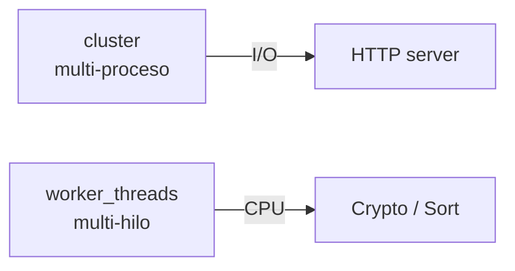
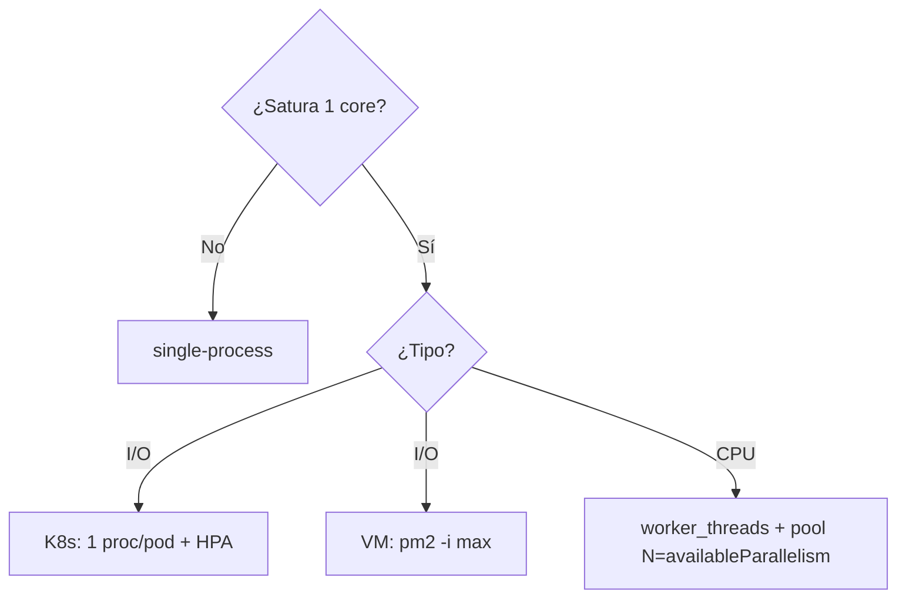

# Cheat Sheet — Clusters + Worker Threads

> **Diátaxis: Reference** · *information-oriented* · Sin pasos, sin historia, sin opiniones. Datos exactos, ordenados, exhaustivos. Si buscas aprender paso a paso → Tutorials `01`, `03`, `04`; si buscas entender por qué → `cluster-vs-worker.md` (Explanation); si buscas resolver tarea → `02`, `simulacro.md` (How-to).

**Versión:** Node 20+ · `isPrimary` (no `isMaster`, deprecado v16) · `availableParallelism()` preferido a `cpus().length`.

## Cluster — API mínima

```js
import cluster from 'node:cluster';
import os from 'node:os';
const n = os.availableParallelism?.() ?? os.cpus().length;
if (cluster.isPrimary) { for(let i=0;i<n;i++) cluster.fork(); cluster.on('exit',()=>cluster.fork()); }
else { server.listen(3000); } // workers comparten puerto (RR en primary por defecto)
```

| Símbolo | Tipo | Notas |
|---|---|---|
| `cluster.isPrimary` | boolean | `true` en primary. Alias deprecado: `isMaster` (v16) |
| `cluster.isWorker` | boolean | `!isPrimary` |
| `cluster.fork()` | Worker | Solo en primary. Usa `child_process.fork()` + IPC |
| `cluster.on('exit', cb)` | event | `cb(worker, code, signal)` — re-lanza con `fork()` |
| `cluster.worker` | Worker | Solo en worker. `worker.id`, `worker.process.pid` |
| `cluster.schedulingPolicy` | enum | `SCHED_RR` (default, RR en primary) / `SCHED_NONE` (SO) |
| `availableParallelism()` | number | Node 19+, preferido a `cpus().length` |

## Worker Threads — API mínima

```js
import { Worker, isMainThread, parentPort, workerData } from 'node:worker_threads';
if (isMainThread) new Worker(import.meta.filename, { workerData: 42 });
else parentPort.postMessage(workerData * 2);
```

| Símbolo | Tipo | Notas |
|---|---|---|
| `isMainThread` | boolean | `false` dentro del Worker |
| `parentPort` | MessagePort | `null` en main. `parentPort.postMessage(msg)` / `parentPort.on('message', cb)` |
| `workerData` | any | Clonado vía structured clone (no referencia) |
| `new Worker(file, {workerData})` | Worker | `worker.on('message'/'error'/'exit', cb)` |
| `SharedArrayBuffer` / `Atomics` | mem | Solo así se comparte memoria real; `workerData` se clona |

## Diferencia clave (Reference seca)

|  | `cluster` | `worker_threads` |
|---|---|---|
| Unidad | proceso OS, V8 aislado | hilo, mismo proceso |
| Memoria | aislada | `SharedArrayBuffer` + `Atomics` si se pide |
| Uso | escalar HTTP I/O | CPU sin bloquear loop |
| Overhead | N× RAM | ligero, pero pool requerido |



## Comandos (Reference)

| Comando | Cuándo |
|---|---|
| `node src/cluster-hello.js` | demo cluster nativo |
| `pm2 start app.js -i max --name app` | prod VM (`exec_mode: "cluster"`, `instances: "max"`) |
| `pm2 reload app` | zero-downtime |
| `node src/worker-hello.js` | demo worker |
| `node --test` | tests del repo (27 tests) |

## Árboles condensados (Reference, no Explanation)



## Trade-offs (Reference, sin narrativa)

- Cluster: + throughput I/O, − N× RAM, sin estado compartido, requiere `SIGTERM → server.close → exit(0)`.
- Worker: + no bloquea loop, − complejidad, requiere `w.on('error')`, pool (`piscina`/`tinypool`) si muchas tareas.

## Errores frecuentes (Reference, sin por qué)

- `isMaster` → usar `isPrimary`.
- `workerData` se clona, no se comparte (compartir requiere `SharedArrayBuffer`).
- Crear workers > `availableParallelism()` sin pool → thrashing.

## Verificación rápida (10 preguntas, Reference para auto-test)

1. `isPrimary` vs `isMaster` 2. ¿Qué hace `fork()`? 3. ¿Por qué mismo puerto no falla? 4. ¿Sesiones dónde? 5. Cluster vs worker? 6. `SIGTERM` cómo? 7. PM2 vs nativo vs K8s? 8. ¿Cuándo NO usar? 9. Worker vs pool? 10. Define cluster en 30s.

> Para respuestas narrativas → `respuestas-30s.md` (How-to). Para entender por qué cada trade-off existe → `05-decision-troubleshooting.md` (Explanation).
