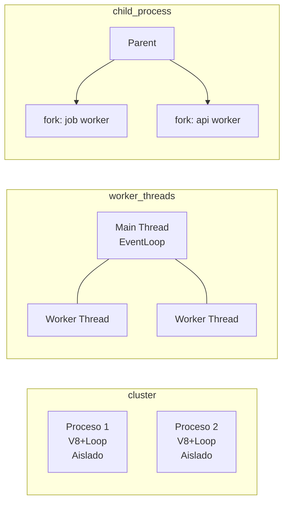
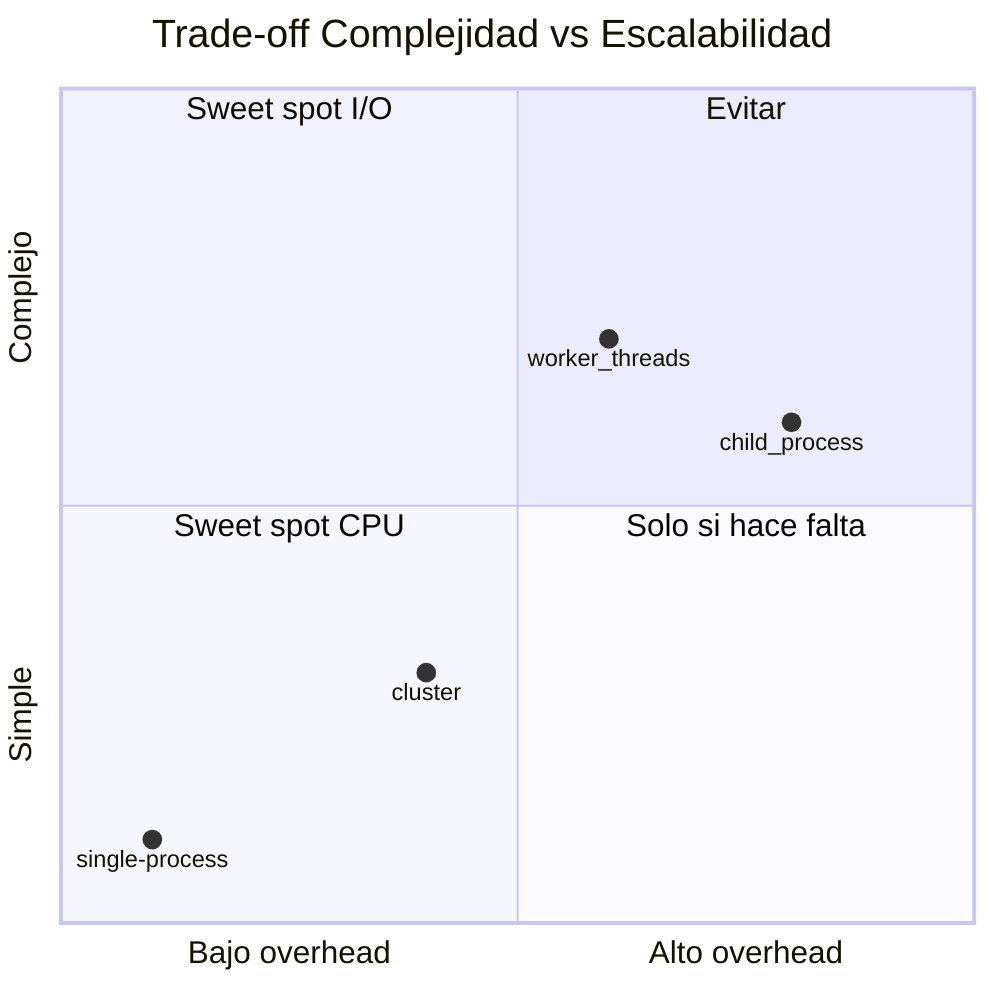

# Por qué `cluster`, `worker_threads` y `child_process` no son intercambiables

> **Diátaxis: Explanation** · *understanding-oriented* · No te dice cómo ejecutar un comando. Te da contexto para entender cuándo cada uno es la herramienta correcta y cuándo es un anti-patrón. Si buscas pasos → `02-cluster-produccion.md` o `04-worker-threads-practica.md` (How-to/Tutorial); si buscas datos secos → `cheat-sheet.md` (Reference).

## El problema que cada uno resuelve

Node es single-thread. Eso deja 7 cores ociosos en una máquina de 8. Pero "usar más cores" no es una sola necesidad:

- **Necesidad I/O:** tu API HTTP pasa el tiempo esperando DB/red. El event loop está ocioso, pero un solo proceso no puede aceptar más conexiones. Solución histórica: **múltiples procesos idénticos que comparten el puerto** (`cluster`). Cada uno con su V8 y heap aislado — si uno muere, los otros siguen.

- **Necesidad CPU:** tu request hace `crypto`, `JSON.parse` grande o `fib(40)`. El event loop se bloquea 200ms y todas las requests esperan. Solución: **hilos en el mismo proceso** (`worker_threads`) que hacen el cálculo y responden por `parentPort`. Comparten `ArrayBuffer`/`SharedArrayBuffer` con `Atomics`, pero no duplican V8.

- **Necesidad heterogénea:** tu app necesita un proceso para API y otro para jobs con código distinto. No son copias idénticas. Solución: `child_process.fork/exec/spawn`.

> Verificado Node 26: "When process isolation is not needed, use the worker_threads module instead" (cluster docs) y "Workers are useful for CPU-intensive... They do not help much with I/O" (worker_threads docs) — ver `VERIFICACION.md`.

## Comparativa honesta (no es Reference exhaustiva)

|  | ¿Qué crea? | Memoria | Aislamiento | Cuándo lo elige la industria 2025 |
|---|---|---|---|---|
| `cluster` | 1 proceso × core, idénticos | Aislada (sin `SharedArrayBuffer`) | Fuerte (crash de uno no mata a otros) | VM single-host sin K8s, o demo de entrevista |
| `worker_threads` | 1 proceso, N hilos | Compartible (solo con `SharedArrayBuffer`+`Atomics`) | Débil (crash puede afectar proceso) | CPU-bound en cualquier host, siempre con pool (`piscina`/`tinypool`) |
| `child_process` | Procesos heterogéneos | Aislada, IPC explícito | Fuerte | Jobs, scripts externos, no para escalar HTTP |

Regla de 30s (simplificación intencional, no regla absoluta): **I/O → cluster/PM2 · CPU → worker_threads · Heterogéneo → child_process**. El contexto (K8s, sticky sessions, memoria) matiza — ver `05-decision-troubleshooting.md`.

## Trade-offs que importan en entrevista

- **Cluster:** + throughput I/O sin Nginx, − N× RAM (duplica V8), no comparte estado (sesiones → Redis), debugging N PIDs. En K8s el consenso 2025 es **no usar cluster dentro del container** — escala con `Deployment replicas` (ver `VERIFICACION.md`).
- **Worker threads:** + no bloquea loop, hilos ligeros, − complejidad (olvidar `w.on('error')` → silencio), compartir memoria requiere disciplina. Siempre con pool; crear un Worker por request "exceeds benefit" (docs oficiales).
- **Single-process:** a veces la respuesta correcta es no usar ninguno de los dos (ver `05-decision-troubleshooting.md`).

## Por qué no son intercambiables (historia breve)

`cluster` (2011) resolvió multi-core antes de que existieran `worker_threads` (2018). Hoy `worker_threads` es estable desde Node 12, y `PM2`/`K8s` absorben el caso de uso de `cluster` en prod. Entender esta evolución te permite responder "¿por qué no siempre cluster?" sin sonar a receta.

> Si buscas **cómo** implementar cada uno paso a paso, no es aquí — ve a Tutorials `01`, `03`, `04`. Si buscas **datos exactos** (API, opciones, versiones), ve a `cheat-sheet.md`.
